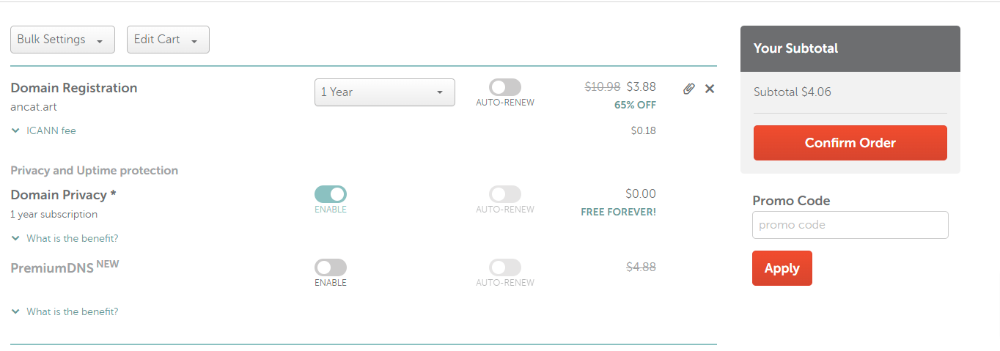

# Instructions

```js
	const headings: Heading[] = []
	const env: MarkdownItEnv = {}
	const mdi = MarkdownIt().use(MarkdownItAnchor, {
		callback: (token, info) => {
			const heading = { ...info } as Heading
			heading.tag = token.tag
			headings.push(heading)
		},
	}).use(frontmatterPlugin)
```

## Go to [Namecheap](https://www.namecheap.com/)


## Input the domain you want to buy
Namecheap will display a list of domains. Some of the domains have been purchased by someone. And still there are many domains avaiable for sale.


## Pick a domain you are interested in.
Here I pick ancat.art for example. Click *Add To Cart* and then *Checkout*


## Click confirm order.

## Login if you have had a account or sign up.


## Type in your credit card info and click *Pay Now*.

Whoops! You hava a domain now.

